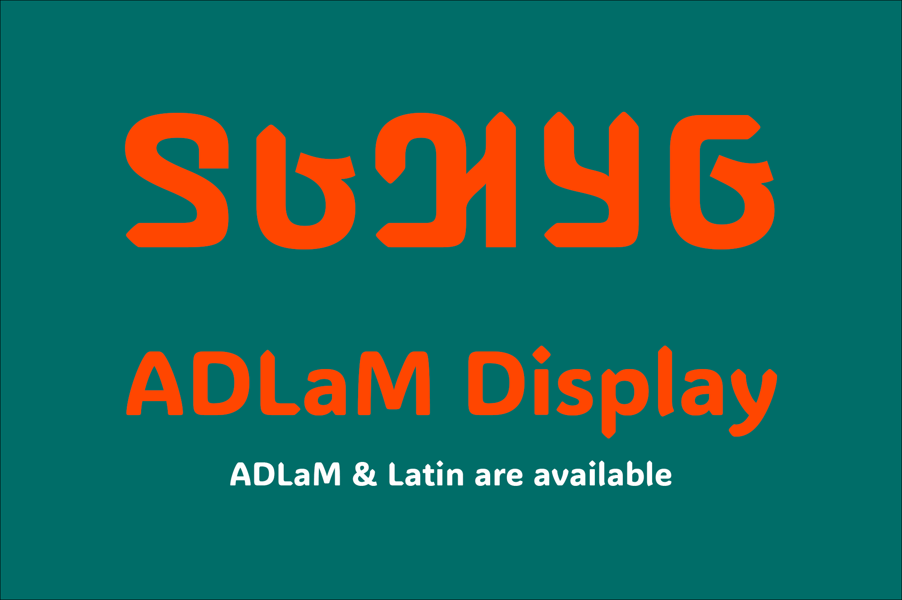
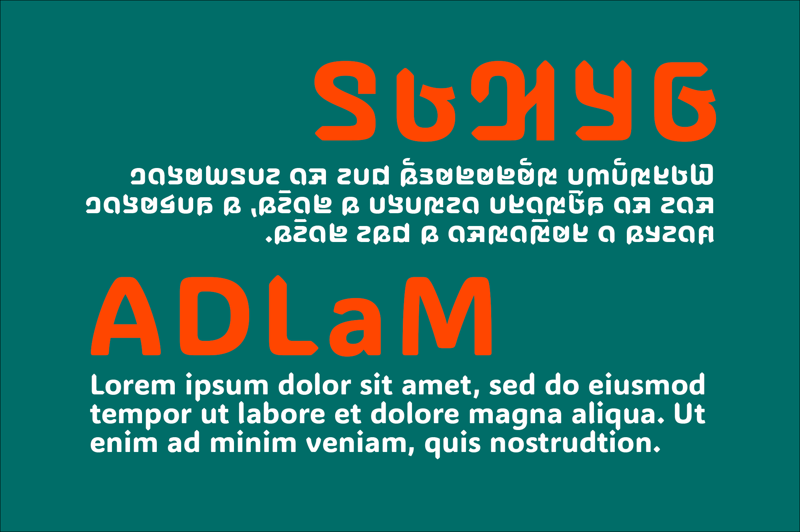

# ADLaM Display

## Basic Information
To help address the lack of display typefaces for the ADLaM script, invented by Ibrahima and Abdoulaye Barry, Microsoft commissioned three renowned type designers Neil Patel, Mark Jamra, and Andrew Footit to create ADLaM Display. The team created the font by taking inspiration from the spots, triangles, lozenges and chevrons patterns found in traditional khasas (blankets), Wodaabe (hats), and textiles of the Fulani culture.

## Including characters
ADLaM Codepage (1E900–1E959), MS CP 1252

## Designers
Neil Patel 
Mark Jamra
Andrew Footit 
 
## Contributing

This project welcomes contributions and suggestions.  Most contributions require you to agree to a
Contributor License Agreement (CLA) declaring that you have the right to, and actually do, grant us
the rights to use your contribution. For details, visit https://cla.opensource.microsoft.com.

When you submit a pull request, a CLA bot will automatically determine whether you need to provide
a CLA and decorate the PR appropriately (e.g., status check, comment). Simply follow the instructions
provided by the bot. You will only need to do this once across all repos using our CLA.

This project has adopted the [Microsoft Open Source Code of Conduct](https://opensource.microsoft.com/codeofconduct/).
For more information see the [Code of Conduct FAQ](https://opensource.microsoft.com/codeofconduct/faq/) or
contact [opencode@microsoft.com](mailto:opencode@microsoft.com) with any additional questions or comments.
